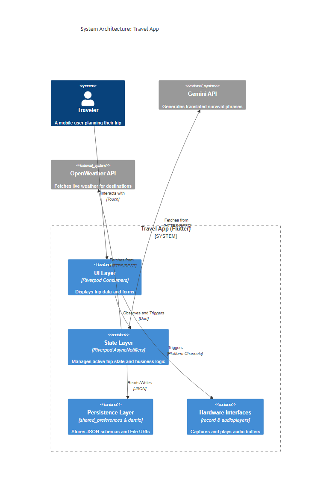
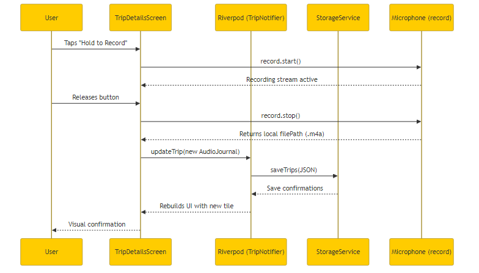

# Travel App: Project Masterclass

Welcome to the deep-dive architectural masterclass for the **Travel App**. This document transitions you from "writing code that works" to "engineering software that scales."

We chose the **Flutter / Dart** stack powered by **Riverpod** because modern mobile applications require highly reactive UI components that can effortlessly sync with local databases, hardware peripherals, and remote APIs asynchronously. 

---

## Architecture Deep Dive

The Travel App relies on a localized, reactive architecture. At its core, the UI is entirely decoupled from the business logic. Instead, the UI passively "listens" to a unified state pool managed by Riverpod.

### System Diagram

### Key Architectural Layers:
1. **The UI Layer (Flutter widgets)**: These widgets do not hold their own state. Instead of `setState`, they use `ConsumerWidget` and `ref.watch()` to mathematical subscribe to streams of data. When data changes, only the specific widgets listening to that data rebuild.
2. **The State Layer (Riverpod)**: Classes like `TripNotifier` inherit from `AsyncNotifier`. This is the "brain." It abstracts away the complexity of checking if data is currently loading, throwing an error, or successfully loaded. 
3. **The Persistence Layer (shared_preferences & dart:io)**: Because mobile apps are frequently killed by the OS to save RAM, we must instantly persist changes to the disk. 
4. **Hardware & API Gateways**: Abstracted bridges that allow Dart to talk to C++ microphone buffers or make HTTPS calls to Gemini. 

---

## Core Concepts & Best Practices

Here are 3 fundamental concepts we implemented in this codebase, and why they matter in enterprise architecture:

### 1. The Immutability Pattern (Freezed)
**What it is:** Instead of modifying an object's properties directly (`trip.destination = "Tokyo"`), we completely destroy the old object and create a brand new one with the updated property (`trip.copyWith(destination: "Tokyo")`).
**Why it's a best practice:** Mutable state causes bugs. If two widgets share an object and one mutates it, the other widget might not realize it needs to redraw. By forcing immutability, we guarantee that every change results in a brand new object reference, which Riverpod can instantly detect.
*See: `lib/features/home/models/trip.dart`*

### 2. Dependency Injection via Providers
**What it is:** Instead of instantiating services directly inside widgets (`var storage = StorageService()`), we expose them globally through Providers (`final storageServiceProvider = Provider(...)`).
**Why it's a best practice:** It forces decoupling. If we ever want to switch from local `shared_preferences` to Cloud Firestore, we only change the `StorageService`. Furthermore, it makes the app universally testable because we can inject "Mock" dependencies during UI testing.
*See: `lib/features/home/providers/trip_provider.dart` (Check out the `// TUTORIAL:` comments!)*

### 3. Slivers for Mathematical Scrolling
**What it is:** We migrated away from standard `ListViews` in favor of `CustomScrollView` and `SliverAppBar`.
**Why it's a best practice:** Slivers treat scrollable areas mathematically, offloading the render complexity directly to the GPU wrapper. This allows for hyper-advanced scroll effects (like hero images that collapse into tiny navigation bars) without dropping below 60 frames per second.
*See: `lib/features/trip_details/screens/trip_details_screen.dart` (Check out the `// TUTORIAL:` comments!)*

---

## Data Flow Breakdown: The Audio Journal
To understand the full lifecycle of the app, let's trace a single complex user action: Recording an Audio Journal.

When the user records an audio snippet, they aren't just saving a file; they are triggering a cascade of events that touches the hardware, the state engine, the visual UI, and the hard drive.

1. **User Action:** The user taps and holds "Record".
2. **Hardware:** The `record` package opens a channel to the Android kernel, streaming bytes directly to the `/data/user/0` partition as an `.m4a` file.
3. **State Mutation:** Once stopped, the file path is bundled into an `AudioJournal` object. The `TripNotifier` generates a new asynchronous representation of the user's entire trip history.
4. **Persistence:** The `StorageService` immediately serializes the new state tree into JSON and burns it to disk. 
5. **Reactivity:** The `ConsumerWidgets` listening to Riverpod detect the new object reference and redraw instantly to display the new Audio Journal tile.

---

## Your Next Steps
To solidify this knowledge, open your editor and jump into the codebase. 

I've left several `// TUTORIAL:` comments placed strategically throughout the code to explain *why* certain blocks were written. Start with `lib/features/trip_details/screens/trip_details_screen.dart` to see reactive programming and sliver mathematics in action!
