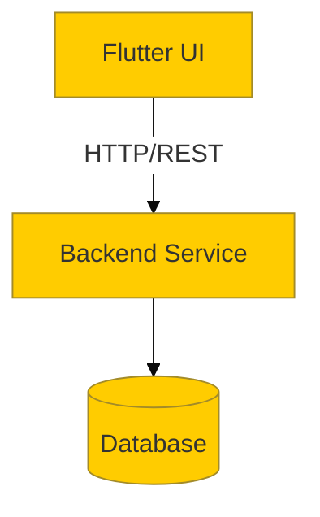

# System Architecture

## Overview
High-level overview of the application's architecture.

## Component Diagram
*(Example of how to embed a Mermaid diagram with fallback images as per the embed-diagrams workflow)*

*(When generating real diagrams, replace this placeholder with an actual embedded PNG saved in `project_docs/assets/` using `mermaid-cli`)*

## Core Technologies
- Frontend: 
- Backend:
- Database: 
